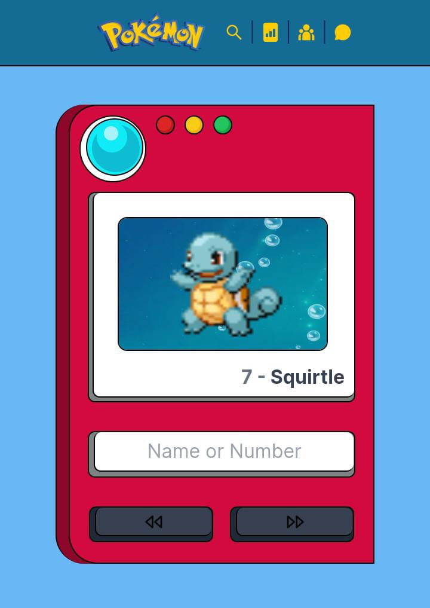
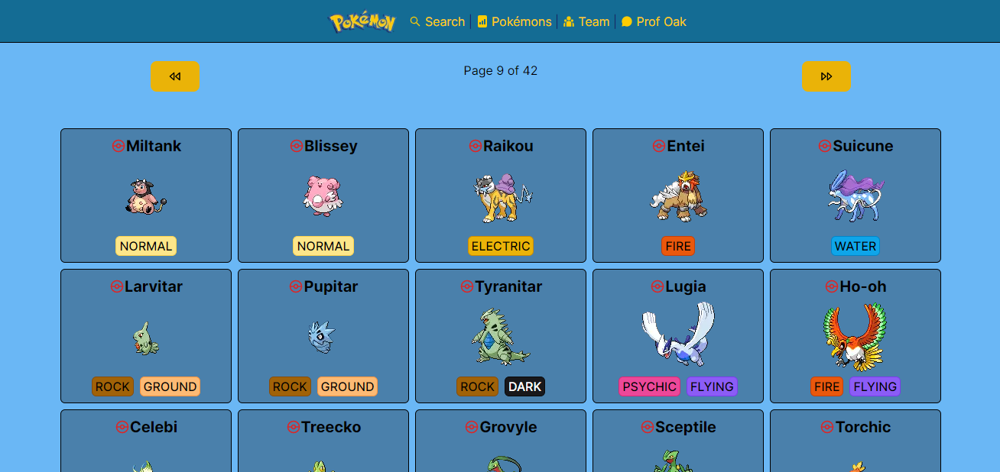
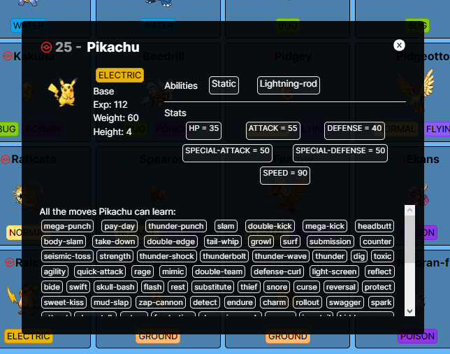
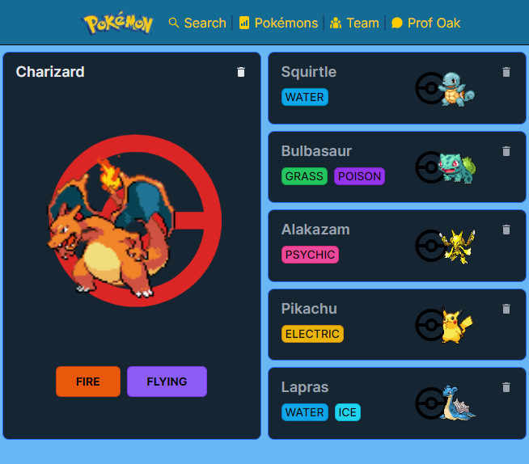
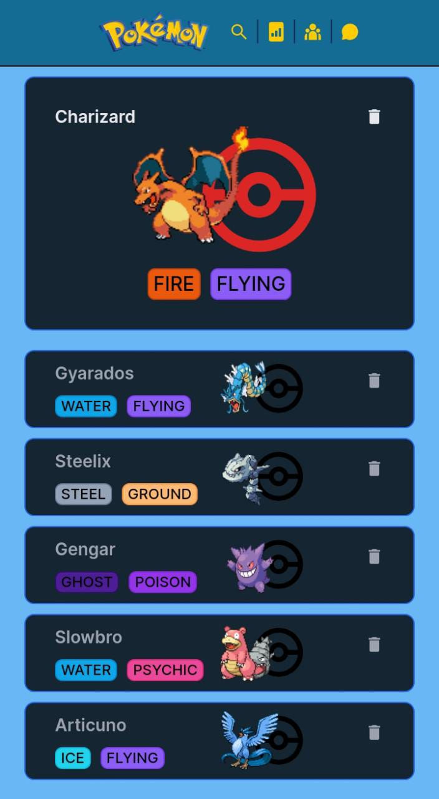
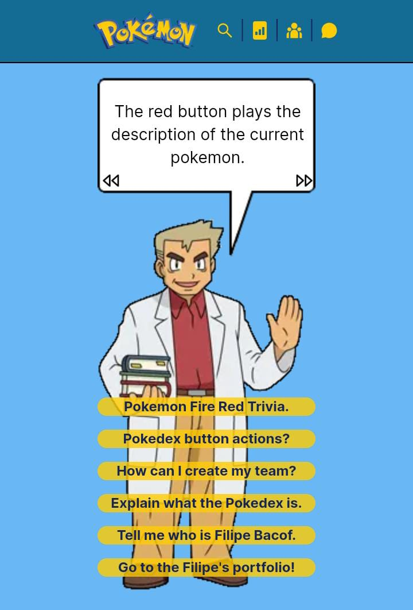

# Desafio Técnico Instituto Nicolas Bueno

## Projeto: Pokédex
[Ver Requisitos do Desafio](https://github.com/Filipe-Bacof/pokedex-inb/blob/master/DESAFIO.md)

Aplicação desenvolvida entre os dias `28 de Junho` e `02 de Julho` de 2023.

[ Ver Deploy](https://pokedex-bacof.vercel.app)

[ Documentação PokeAPI](https://pokeapi.co/docs/v2)

[ Ver Portifólio Filipe Bacof](https://portifolio-filipe-bacof.vercel.app/)

## Tecnologias Utilizadas:
[ Next.JS](https://nextjs.org)

[ React.JS](https://react.dev)

[ Typescript](https://www.typescriptlang.org)

[ Tailwind CSS](https://tailwindcss.com)

# Prints do Projeto:
## A tela principal é a pokedéx inspirada no anime
- O botão vermelho narra uma curiosidade sobre o pokémon em tela (se clicar novamente é interrompido);
- O botão amarelo adiciona o pokémon atual para o seu time (ver próximos prints);
- O botão verde faz com que o pokémon atual seja o resultado ao abrir a pokédex no seu dispositivo (por padrão é o Bulbasaur);
- O auto-falante possui uma animação para quando está sendo feita uma narração;
- O plano de fundo se altera dependendo do tipo primário de cada pokémon;
- Há um Easter-Egg escondido, apenas os curiosos irão encontrar;

## A segunda opção do menu contém a listagem de todos os pokémons
- A paginação foi feita de 30 em 30 resultados;

- Ao clicar em um card, abre o modal para visualizar mais dados sobre aquele pokémon;

## A terceira opção do menu exibe o seu time
- Os pokémons escolhidos para o seu time são armazenados no Local Storage;
- Há o limite para 6 pokémons no seu time;
- Caso remova qualquer um dos pokémons do seu time, o próximo a ser adicionado preencherá aquela posição;

- Essa tela foi adaptada para dispositivos móveis também (Tailwind é Mobile First);

## Na última opção do menu encontra-se o Professor Carvalho
- Essa tela é uma espécie de tira dúvidas sobre como utilizar a pokédex;
- Inseri uma trivia do jogo Pokémon Fire Red para despertar a nostalgia de quem jovaga no Game Boy;

# Sobre o TypeScript
É super recomendado o uso de TypeScript em qualquer projeto. O TypeScript adiciona recursos de tipagem estática ao JavaScript, trazendo vários benefícios como:
- `Verificação de tipagem em tempo de compilação`: O TypeScript permite detectar erros de tipagem antes mesmo da execução do código, o que ajuda a evitar bugs e torna o desenvolvimento mais robusto.
- `Melhor IntelliSense e autocomplete`: Com o uso de tipos explícitos, o TypeScript melhora a experiência de desenvolvimento, fornecendo sugestões de código e informações mais precisas sobre as APIs utilizadas.
- `Refatoração mais segura`: O TypeScript permite a reestruturação do código com mais segurança, pois pode identificar potenciais problemas e fornecer avisos durante a refatoração.
- `Maior legibilidade`: Com a adição de tipos, o código se torna mais legível e autoexplicativo, o que facilita a compreensão e a manutenção do código ao longo do tempo.
